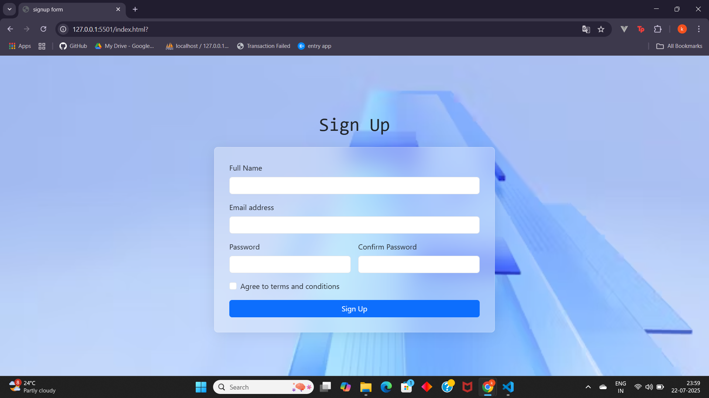

# Sign Up Form Validation using HTML, CSS, Bootstrap & JavaScript

#Introduction

This project is a responsive Sign Up form built with **HTML**, **CSS**, **Bootstrap**, and **JavaScript**.  
It demonstrates strong client-side validation, ensuring data integrity and improving user experience through real-time feedback.

---

##  Features
- Responsive design using Bootstrap  
- Full name validation: only letters and spaces  
- Password validation: at least 8 characters, one letter, one digit, one special character  
- Confirm password must match password  
- Real-time validation feedback  
- Glassmorphism effect on the form for modern UI feel  
- Prevents form submission until all validations pass

---

## Technologies Used
- HTML5
- CSS3
- [Bootstrap 5.3]
- JavaScript (ES6)

---

##  Setup & Usage
1. Clone or download the repository.
2. Open `index.html` in your web browser.

No additional installation is required as Bootstrap is included via CDN.

---

##  Form Fields
- **Full Name**: Must contain only letters and spaces.
- **Email Address**: Valid email format.
- **Password**: At least 8 characters, including at least one letter, one digit, and one special character.
- **Confirm Password**: Must match the password field.
- **Terms & Conditions**: Checkbox must be checked before submission.

---

## Validation Logic
Validation is implemented in `js/validation.js`:
- Checks password strength using regex.
- Ensures password and confirm password match.
- Uses `setCustomValidity` and Bootstrap's `was-validated` classes for custom messages and UI feedback.

---

##  Styling
- Built using Bootstrap grid and utility classes.
- Custom CSS (`css/styles.css`) adds glassmorphism effect to the form.
- Responsive and visually clean layout.

---

##  License
This project is for educational purposes only.
---

## Author
> Created as part of **Module End Assignment 02**:  
> _Sign Up Form Validation using HTML, CSS, Bootstrap, and JavaScript_

---

##  Preview

---

